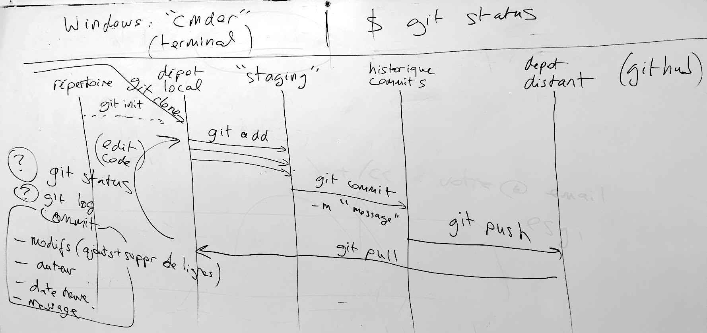
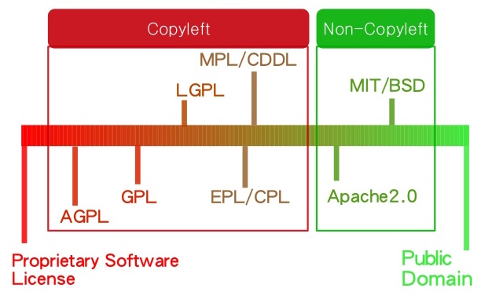

class: center, middle

# Outils: `git`
# EEMI (2019)
## [adrienjoly.com/cours-git](https://adrienjoly.com/cours-git/)

<!-- forked from https://github.com/adrienjoly/cours-javascript/tree/gh-pages/M -->

---
class: dbl-size
# Objectifs

- Comprendre l’**intérêt** de `git` et GitHub
- Maîtriser les **commandes** de base
- Savoir résoudre les **conflits**
- Projets **Open Source** et principes de collaboration

Application: ajouter sa photo à un trombi web.

---
class: dbl-size
## Partie 1 - terminologie, flot, commandes de base

- TD: [Créer un dépôt git sur gitlab de l'EEMI](../tutos/creer-depot-gitlab-eemi.html)
- TD: [Collaborer sur un dépôt gitlab](../tutos/collaborer-sur-un-depot-gitlab.html)

## Partie 2 - contribuer à un projet git

- TD: [Régler un conflit de fusion](../tutos/conflit-de-fusion)
- TD: [Contribuer à un projet open source sur GitHub](../tutos/contribution-open-source)

---
class: dbl-size, center, middle

# Partie 1/2

---
class: dbl-size
# Git, pour quoi faire ?

.wide[]
.wide[]

---
class: dbl-size
# Git, pour quoi faire ?

- **éditer** fichier à plusieurs
- **garder** historique des modifs
- **isoler** les améliorations

???

- éditer des fichiers à plusieurs, de manière concurrente, en évitant les pertes de données
- garder un historique des modifications et des versions
- isoler les améliorations en cours de la version qui fonctionne
- (illustration: linux-code.png)

---
class: dbl-size
# Avant git

- 1990: CVS
- 1994: Microsoft SourceSafe
- 2000: Subversion
- 2005: Git, Mercurial

???

- git créé par Linus Torvalds, pour intégrer les contributions sur son projet Linux
- critères: vitesse, décentralisation, intégrité des données

---
class: dbl-size
# Plateformes git

.wide[]

---
class: dbl-size
# Terminologie git

- **Repository** (dépôt)
- **Staging** (index)
- **Commit**
- **Branch**
- **Merge** (fusion)

???

- **Repository** (dépôt): espace de stockage du code source, local ou distant (remote)
- **Staging** (index): une mise à jour en cours d'assemblage
- **Commit**: une mise à jour du code source: lignes de code de fichier(s)
- **Branch**: une suite de commits liés entre eux
- **Merge** (fusion): intégrer les mises à jour d'une branche dans une autre

---
class: dbl-size
# Modèle de git: branches et commits

.center[]

---
class: dbl-size
# Séquence d'usage des commandes

.wide[]

---
class: dbl-size
# Commandes git

- `git clone` (ou `git init`)
- `git status`
- `git pull`
- `git add`
- `git commit`
- `git push`

???

- `git clone` (ou `git init`): importer ou créer un dépôt localement
- `git status`: afficher l'état de l'index
- `git pull`: récupérer mises à jour depuis dépôt distant
- `git add`: ajouter les mises à jour de fichier(s) dans l'index
- `git commit`: empaqueter les mises à jour de l'index
- `git push`: envoyer les commits dans le dépôt distant

---
class: dbl-size
# 🏋 Mise en pratique

1. [Créer un dépôt git sur gitlab de l'EEMI](../tutos/creer-depot-gitlab-eemi.html)
2. [Collaborer sur un dépôt gitlab](../tutos/collaborer-sur-un-depot-gitlab.html)

---
class: dbl-size
# 🏆 Pro tips

- Harmoniser l'encodage des fin de lignes (`autocrlf` / `safecrlf`) avec git config, cf ([1](https://githowto.com/setup)) ou ([2](https://help.github.com/articles/dealing-with-line-endings/))
- Visualisation de l'historique dans le terminal: [`git lola`](http://blog.kfish.org/2010/04/git-lola.html)
- Éviter d'avoir à taper son mot de passe à chaque fois:
  - [Stockage des identifiants](https://git-scm.com/book/fr/v2/Utilitaires-Git-Stockage-des-identifiants),
  - ou [Configure SSK key](https://docs.gitlab.com/ee/university/training/topics/env_setup.html#configure-ssh-key),
  - ou encore [GitLab and SSH keys](https://docs.gitlab.com/ee/ssh/) (plus détaillé)

---
class: dbl-size, center, middle

# Partie 2/2

- Régler un conflit de fusion
- Contribuer à un projet open source sur GitHub

---
class: dbl-size
# Conflit de fusion

.center[]

???

Un conflit intervient lorsque la même partie d'un même fichier a été modifiée par deux branches en cours de fusion.

=> Il faut aider `git` à résoudre ce conflit, en décidant quelle doit contenir la version finale du fichier.

---
class: dbl-size
# Commandes git 2/2

- `git log`
- `git branch`
- `git checkout`
- `git diff`
- `git merge`

???

- `git log`: afficher l'historique / les commits de la branche
- `git branch`: afficher les branches du dépôt local
- `git checkout`: se placer sur une autre branche / créer une branche
- `git diff`: comparer deux branches (ou commits)
- `git merge`: fusionner une branche dans une autre

---
class: dbl-size, center, middle

# Exercice
## [Conflit de fusion](../tutos/conflit-de-fusion)

---
class: dbl-size
# Découverte des projets Open Source

- But: Contribuer à un projet sur GitHub
- Exemples de projets
- Licences
- Workflow de collaboration: GitHub Flow

---
class: dbl-size
# Exemples

- [github.com/torvalds/linux](https://github.com/torvalds/linux)
- [github.com/chromium/chromium](https://github.com/chromium/chromium)
- [github.com/Microsoft/vscode](https://github.com/Microsoft/vscode)
- [github.com/steeve/france.code-civil](https://github.com/steeve/france.code-civil)
- [github.com/explore](https://github.com/explore)

---
class: dbl-size
# Licences

.center[]

---
class: dbl-size
# GitHub Flow

.wide[]

---
class: dbl-size
# GitHub Flow

.wide[]

---
class: dbl-size
# Collaboration autour du GitHub Flow

- *issues* = tâches / bugs
- *fork* = dérivation
- *pull request* = proposition
- *peer review* = discussion

---
class: dbl-size, center, middle

# Exercice à rendre
## [Contribuer à un projet open source sur GitHub](../tutos/contribution-open-source)

---
class: dbl-size, center, middle

# Merci pour votre attention ! 🙌

## [adrienjoly.com/now](https://adrienjoly.com/now)
## [twitter.com/adrienjoly](https://twitter.com/adrienjoly)
## [github.com/adrienjoly](https://github.com/adrienjoly)

Conseils: carrière de dév / startups / side projects / stages...
